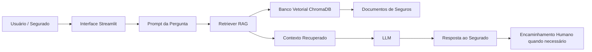

# Diagrama da Arquitetura

```mermaid
flowchart LR
    A[Usuário / Segurado] --> B[Interface Streamlit]
    B --> C[Prompt da Pergunta]
    C --> D[Retriever RAG]
    D --> E[Banco Vetorial ChromaDB]
    E --> F[Documentos de Seguros]
    D --> G[Contexto Recuperado]
    G --> H[LLM]
    H --> I[Resposta ao Segurado]
    I --> J[Encaminhamento Humano quando necessário]
```
